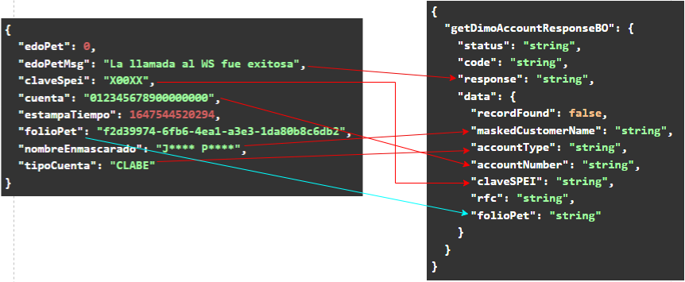

[<-- Volver al listado de operaciones](./../../index.md)

# Dimo Service / getDimoAccount

###  Esta operación permite consultar a través del proveedor Praxis, si un número de teléfono está vinculado a una cuenta CLABE en la base de datos de Banxico para realizar transferencias Dimo.
---


## Tabla de control de cambios
|Responsable|Historia de usuario|Descripción del cambio|
|-|-|-|
|exbhgarcia|[86b1x64g2](https://app.clickup.com/t/86b1x64g2)|Se adiciona la operación al servicio|

---


## Diagrama de componentes
Imagen

---


## Request Body
```
{
  "getDimoAccountRequestBO": {
    "applicationId": "string",
    "cellphoneNumber": "string"
  }
}
```
## Especificación de objetos y atributos del Request


---

## Response Body
```
{
  "getDimoAccountResponseBO": {
    "status": "string",
    "code": "string",
    "response": "string",
    "data": {
      "recordFound": false,
      "maskedCustomerName": "string",
      "accountType": "string",
      "accountNumber": "string",
      "claveSPEI": "string",
      "rfc": "string",
      "folioPet": "string"
    }
  }
}
```
## Especificación de objetos y atributos del Request


---

## Estados de respuesta

---
## Códigos de respuesta


---


## URL de API por ambiente
---


## Ejemplo de consumo del API - cURL
---


## Componentes de integración relacionados
---
## Componentes externos relacionados
---

## Mapeos
## Request: Integración ---> Praxis

## Response Praxis ---> Integración
