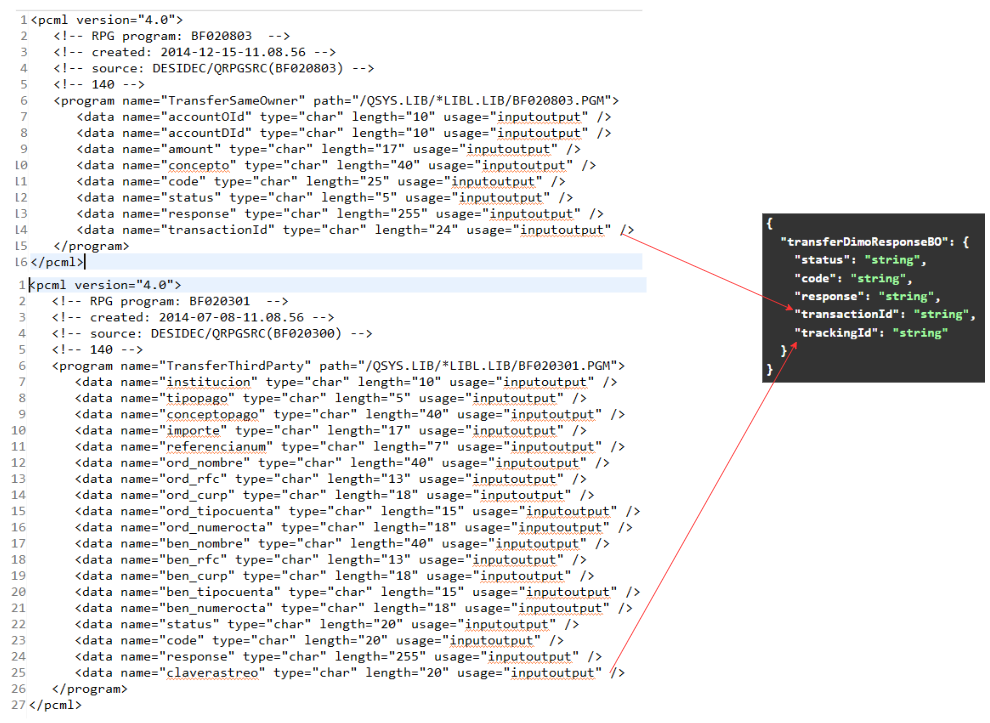

[<-- Volver al listado de operaciones](./../../index.md)

# Dimo Service / transferDimo

###  Esta operación permite realizar transferencias Dimo.
---


## Tabla de control de cambios
|Responsable|Historia de usuario|Versión de API donde se aplica el cambio|Descripción del cambio|
|:-:|:-:|:-:|-|
|exbhgarcia|[86b1x66d4](https://app.clickup.com/t/86b1x66d4)|v1.0.0|Se adiciona la operación al servicio|

---


## Diagrama de componentes


---


## Simbología y convenciones
|Símbolo - Convención|Descripción|
|-|-|
|Campo|Indica el nombre del atributo|
|Tipo|Indica el tipo de dato del atributo|
|M|Campo mandatorio o requerido|
|O|Campo opcional|
|L/Mi|Longitud mínima|
|L/Ma|Longitud Máxima|
|V/C|Indica si es variable o constante|
|N/A|No aplica|
|N/E|No especificado|


## Request Body
```
{
  transferDimoRequestBO: {
    applicationId: "string",
    sessionId: "string",
    accountGUID: "string",
    beneficiaryCellphoneNumber: "string",
    amount: 0,
    description: "string",
    referenceNumber: 0,
    RFCCURPOrderer: "string",
  },
}
```
## Especificación de objetos y atributos del Request
* ### Request Body
| Campo | Tipo | M/O | L/Mi | L/Ma | V/C |
|-|:-:|:-:|:-:|:-:|:-:|
|transferDimoRequestBO|TransferDimoRequestBOObject|M|1|255|V|

* ### TransferDimoRequestBOObject
| Campo | Tipo | M/O | L/Mi | L/Ma | V/C |
|-|:-:|:-:|:-:|:-:|:-:|
|applicationId|String|M|1|255|V|
|sessionId|String|M|1|255|V|
|accountGUID|String|M|1|255|V|
|beneficiaryCellphoneNumber|String|M|10|10|V|
|amount|Number|M|1|17|V|
|description|String|M|1|255|V|
|referenceNumber|Number|M|1|255|V|
|RFCCURPOrderer|String|M|1|255|V|


---

## Response Body
```
{
  "transferDimoResponseBO": {
    "status": "string",
    "code": "string",
    "response": "string",
    "transactionId": "string",
    "trackingId": "string"
  }
}
```
## Especificación de objetos y atributos del Response
* ### Request Body
| Campo | Tipo |
|-|:-:|
|transferDimoResponseBO|TransferDimoResponseBOObject|

* ### TransferDimoResponseBOObject
| Campo | Tipo |
|-|:-:|
|status|String|
|code|String|
|response|String|
|transactionId|String|
|trackingId|String|

---

## Estados de respuesta
|Estado|Descripción|
|:-:|-|
|C|Transacción exitosa|
|E|Transacción errónea|

---
## Códigos de respuesta
|Código|Descripción|
|:-:|-|
|200|Transacción exitosa|
|301|Solicitud con errores|
|500|Error interno|

---


## URL de API por ambiente
|Ambiente|URL|
|-|-|
|Desarrollo|https://apic.consubanco.com/csb/dev/dimo-service/transferDimo|    
|Calidad|https://apic.consubanco.com/csb/qa/dimo-service/transferDimo|
|Producción|https://apic.consubanco.com/csb/prd/dimo-service/transferDimo|

---


## Ejemplo de consumo del API - cURL
```
curl --location 'https://apic.consubanco.com/csb/dev/dimo-service/transferDimo' \
--header 'Content-Type: application/json' \
--header 'Accept: application/json' \
--header 'X-IBM-Client-Id: XXXXXXXXXXXXXXXXX' \
--header 'Cookie: 0f64ea607ea127be876814b5b38b0d94=c6c8f20ec97961f1e06618f4e1fd07e1' \
--data 'REPLACE_REQUEST_BODY'
```
---

<!-- DOCUMENTACION TECNICA -->
## Componentes de integración relacionados
|Componente|Paquete/Clase|Método|
|-|-|-|
|csb-ebanking-icbs-services-core|com.consubanco.ebanking.interfaces.icbs.transfer.dimo.impl.TransferDimoImpl|transferDimo|
|csb-ebanking-icbs-interface|com.consubanco.ebanking.icbs.interfaces.service.impl.CallTransferSameOwnerAccountImpl|transferSameOwner|
|csb-ebanking-icbs-interface|com.consubanco.ebanking.icbs.interfaces.service.impl.CallTransferThirdPartyImpl|transferThirdParty|
|shermfin-ws|DimoService.DimoService.DimoService|getDimoAccount|
|shermfin-ws|DimoService.DimoService.DimoService|validateDimoTransferRules|

---
## Componentes externos relacionados
|Tipo|RPG Program|
|-|-|
|ICBS|BF020803|
|ICBS|BF020301|

---

## Mapeos
## Request: Integración ---> Praxis

## Response Praxis ---> Integración


---