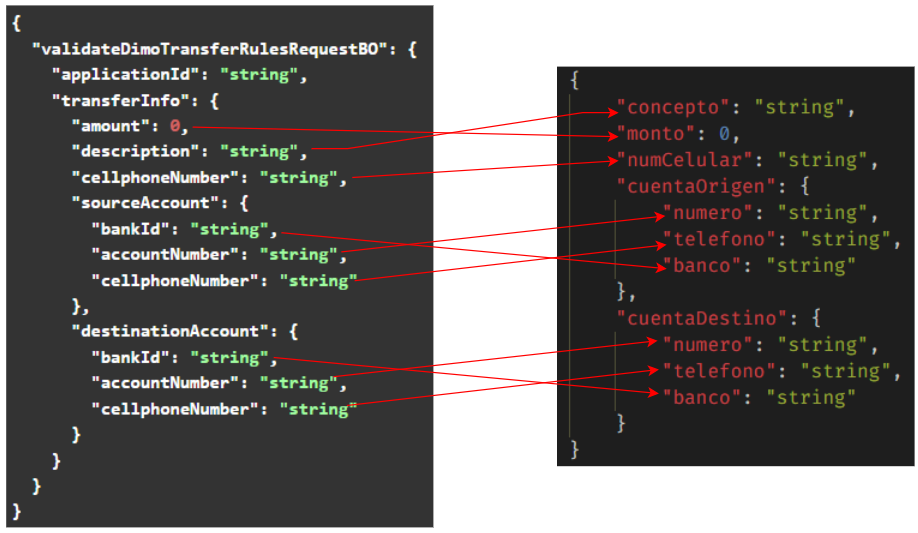

[<-- Volver al listado de operaciones](./../../index.md)

# Dimo Service / validateDimoTransferRules

###  Esta operación permite aplicar reglas de validación a los datos que usarán en una transaferencia Dimo.
---


## Tabla de control de cambios
|Responsable|Historia de usuario|Versión de API donde se aplica el cambio|Descripción del cambio|
|:-:|:-:|:-:|-|
|exbhgarcia|[86b1x665f](https://app.clickup.com/t/86b1x665f)|v1.0.0|Se adiciona la operación al servicio|

---


## Diagrama de componentes


---


## Simbología y convenciones
|Símbolo - Convención|Descripción|
|-|-|
|Campo|Indica el nombre del atributo|
|Tipo|Indica el tipo de dato del atributo|
|M|Campo mandatorio o requerido|
|O|Campo opcional|
|L/Mi|Longitud mínima|
|L/Ma|Longitud Máxima|
|V/C|Indica si es variable o constante|
|N/A|No aplica|
|N/E|No especificado|


## Request Body
```
{
  "validateDimoTransferRulesRequestBO": {
    "applicationId": "string",
    "transferInfo": {
      "amount": 0,
      "description": "string",
      "cellphoneNumber": "string",
      "sourceAccount": {
        "bankId": "string",
        "accountNumber": "string",
        "cellphoneNumber": "string"
      },
      "destinationAccount": {
        "bankId": "string",
        "accountNumber": "string",
        "cellphoneNumber": "string"
      }
    }
  }
}
```
## Especificación de objetos y atributos del Request
* ### Request Body
| Campo | Tipo | M/O | L/Mi | L/Ma | V/C |
|-|:-:|:-:|:-:|:-:|:-:|
|validateDimoTransferRulesRequestBO|ValidateDimoTransferRulesRequestBOObject|M|1|255|V|

* ### ValidateDimoTransferRulesRequestBOObject
| Campo | Tipo | M/O | L/Mi | L/Ma | V/C |
|-|:-:|:-:|:-:|:-:|:-:|
|applicationId|String|M|1|255|V|
|transferInfo|TransferInfoObject|M|1|255|V|

* ### TransferInfoObject
| Campo | Tipo | M/O | L/Mi | L/Ma | V/C |
|-|:-:|:-:|:-:|:-:|:-:|
|amount|Number|M|1|17|V|
|description|String|M|1|255|V|
|cellphoneNumber|String|M|10|10|V|
|sourceAccount|AccountBOObject|M|1|1|V|
|destinationAccount|AccountBOObject|M|1|1|V|

* ### AccountBOObject
| Campo | Tipo | M/O | L/Mi | L/Ma | V/C |
|-|:-:|:-:|:-:|:-:|:-:|
|bankId|String|M|1|17|V|
|accountNumber|String|M|1|64|V|
|cellphoneNumber|String|M|10|10|V|

---

## Response Body
```
{
  "validateDimoTransferRulesResponseBO": {
    "status": "string",
    "code": "string",
    "response": "string"
  }
}
```
## Especificación de objetos y atributos del Response
* ### Request Body
| Campo | Tipo |
|-|:-:|
|validateDimoTransferRulesResponseBO|validateDimoTransferRulesResponseBOObject|

* ### validateDimoTransferRulesResponseBOObject
| Campo | Tipo |
|-|:-:|
|status|String|
|code|String|
|response|String|

---

## Estados de respuesta
|Estado|Descripción|
|:-:|-|
|C|Transacción exitosa|
|E|Transacción errónea|

---
## Códigos de respuesta
|Código|Descripción|
|:-:|-|
|200|Transacción exitosa|
|301|Solicitud con errores|
|500|Error interno|

---


## URL de API por ambiente
|Ambiente|URL|
|-|-|
|Desarrollo|https://apic.consubanco.com/csb/dev/dimo-service/validateDimoTransferRules|    
|Calidad|https://apic.consubanco.com/csb/qa/dimo-service/validateDimoTransferRules|
|Producción|https://apic.consubanco.com/csb/prd/dimo-service/validateDimoTransferRules|

---


## Ejemplo de consumo del API - cURL
```
curl --location 'https://apic.consubanco.com/csb/dev/dimo-service/validateDimoTransferRules' \
--header 'Content-Type: application/json' \
--header 'Accept: application/json' \
--header 'X-IBM-Client-Id: XXXXXXXXXXXXXXXXX' \
--header 'Cookie: 0f64ea607ea127be876814b5b38b0d94=c6c8f20ec97961f1e06618f4e1fd07e1' \
--data 'REPLACE_REQUEST_BODY'
```
---

<!-- DOCUMENTACION TECNICA -->
## Componentes de integración relacionados
|Componente|Paquete/Clase|Método|
|-|-|-|
|brms-services|com.consupago.brms.services.dimo.DimoService|executeDimoTransactionRuleApp|

---
## Componentes externos relacionados
|Tipo|Rules Path|Flow|Inputs|Outputs|
|-|-|-|-|-|
|BRMS|executeDimoTransactionRuleApp|FlujoPrincipal|pruevasDVS<br>solicitud|resultado|

|Componente|Paquete/Clase|
|-|-|
|csb-dimo-xom|com.consubanco.brms.dimo.xom.Solicitud|
|csb-dimo-xom|com.consubanco.brms.dimo.xom.Cuenta|
|csb-dimo-xom|com.consubanco.brms.dimo.xom.Resultado|

---

## Mapeos
## Request: Integración ---> BRMS

## Response BRMS ---> Integración


---