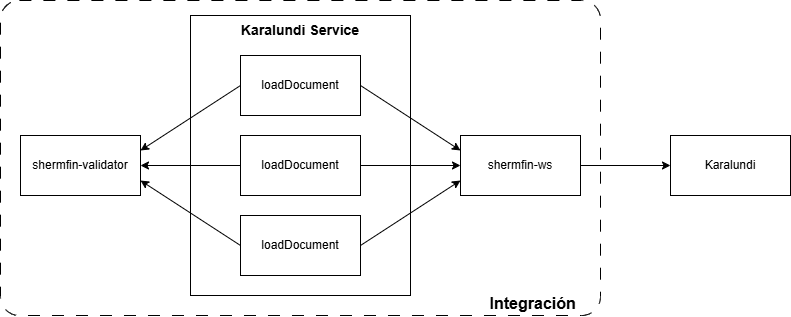
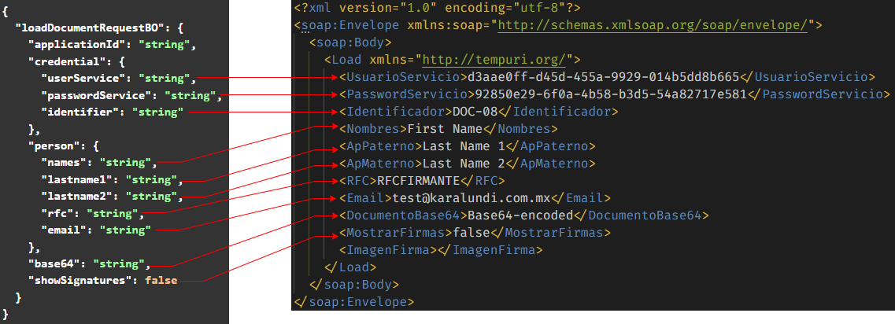
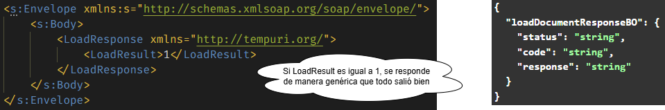

[<-- Volver al listado de operaciones](./../../index.md)

# Karalundi Service / loadDocument

###  Esta operación envía un documento al proveedor Karalundi para que realice la firma del mismo
---


## Simbología y convenciones
|Símbolo - Convención|Descripción|
|-|-|
|Campo|Indica el nombre del atributo|
|Tipo|Indica el tipo de dato del atributo|
|M|Campo mandatorio o requerido|
|O|Campo opcional|
|L/Mi|Longitud mínima|
|L/Ma|Longitud Máxima|
|V/C|Indica si es variable o constante|
|N/A|No aplica|
|N/E|No especificado|


## Request Body
```
{
  "loadDocumentRequestBO": {
    "applicationId": "string",
    "credential": {
      "userService": "string",
      "passwordService": "string",
      "identifier": "string"
    },
    "person": {
      "names": "string",
      "lastname1": "string",
      "lastname2": "string",
      "rfc": "string",
      "email": "string"
    },
    "base64": "string",
    "showSignatures": false
  }
}
```
## Especificación de objetos y atributos del Request
* ### Request Body
| Campo | Tipo | M/O | L/Mi | L/Ma | V/C |
|-|:-:|:-:|:-:|:-:|:-:|
|loadDocumentRequestBO|LoadDocumentRequestBOObject|M|1|255|V|

* ### LoadDocumentRequestBOObject
| Campo | Tipo | M/O | L/Mi | L/Ma | V/C |
|-|:-:|:-:|:-:|:-:|:-:|
|applicationId|String|M|1|255|V|
|credential|CredentialObject|M|1|255|V|
|person|PersonObject|M|1|255|V|
|base64|String|M|1|N/E|V|
|showSignatures|Boolean|M|N/A|N/A|V|

* ### CredentialObject
| Campo | Tipo | M/O | L/Mi | L/Ma | V/C |
|-|:-:|:-:|:-:|:-:|:-:|
|userService|String|M|1|255|V|
|passwordService|String|M|1|255|V|
|identifier|String|M|1|255|V|

* ### PersonObject
| Campo | Tipo | M/O | L/Mi | L/Ma | V/C |
|-|:-:|:-:|:-:|:-:|:-:|
|names|String|M|1|255|V|
|lastname1|String|M|1|255|V|
|lastname2|String|M|1|255|V|
|rfc|String|M|1|255|V|
|email|String|M|1|255|V|


---

## Response Body
```
{
  "loadDocumentResponseBO": {
    "status": "string",
    "code": "string",
    "response": "string"
  }
}
```
## Especificación de objetos y atributos del Response
* ### Response Body
| Campo | Tipo |
|-|:-:|
|loadDocumentResponseBO|LoadDocumentResponseBOObject|

* ### LoadDocumentResponseBOObject
| Campo | Tipo |
|-|:-:|
|status|String|
|code|String|
|response|String|

---

## Estados de respuesta
|Estado|Descripción|
|:-:|-|
|C|Transacción exitosa|
|E|Transacción errónea|

---
## Códigos de respuesta
|Código|Descripción|
|:-:|-|
|200|Transacción exitosa|
|301|Solicitud con errores|
|500|Error interno|

---


## URL de API por ambiente
|Ambiente|URL|
|-|-|
|Desarrollo|https://apic.consubanco.com/csb/dev/karalundi-service/loadDocument|    
|Calidad|https://apic.consubanco.com/csb/qa/karalundi-service/loadDocument|
|Producción|https://apic.consubanco.com/csb/prd/karalundi-service/loadDocument|

---


## Ejemplo de consumo del API - cURL
```
curl --location 'https://apic.consubanco.com/csb/dev/karalundi-service/loadDocument' \
--header 'Content-Type: application/json' \
--header 'Accept: application/json' \
--header 'X-IBM-Client-Id: XXXXXXXXXXXXXXXXX' \
--header 'Cookie: 0f64ea607ea127be876814b5b38b0d94=c6c8f20ec97961f1e06618f4e1fd07e1' \
--data 'REPLACE_REQUEST_BODY'
```
---

## Diagrama de componentes


---

## Componentes de integración relacionados
|Componente|Paquete/Clase|Método|
|-|-|-|
|shermfin-ws|mx.com.karalundi.impl.KaralundiImpl|loadDocument|

---

## Componentes externos relacionados
|Tipo|Método|URL|
|-|-|-|
|SOAP|POST|https://wstestautosign.doc2sign.com/Doc2SignLite.svc|

---

## Mapeos
## Request: Integración ---> Karalundi

## Response Karalundi ---> Integración


---


## Tabla de control de cambios
|Responsable|Historia de usuario|Versión de API donde se aplica el cambio|Descripción del cambio|
|-|-|-|-|
|exbhgarcia|[86b37vbz8](https://app.clickup.com/t/86b37vbz8)|v1.0.0|Se adiciona la operación al servicio|

---

