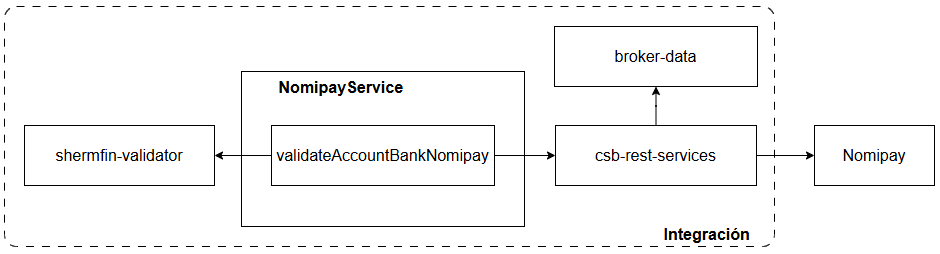
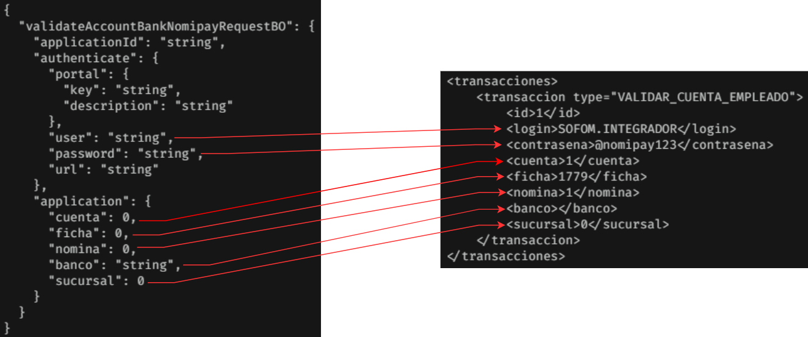
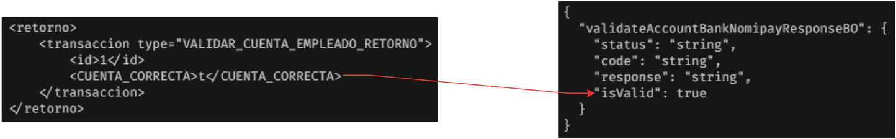

[<-- Volver al listado de operaciones](./../../index.md)

# Nomipay Service / validateAccountBankNomipay

###  Esta operación valida los datos bancarios de un servidor, retornando un valor verdadero (true) si los datos enviados coinciden con los registrados, o un valor falso (false) si uno o más datos son incorrectos.
---


## Tabla de control de cambios
|Responsable|Historia de usuario|Versión de API donde se aplica el cambio|Descripción del cambio|
|:-:|:-:|:-:|-|
|exbhgarcia|[86b2m0z2k](https://app.clickup.com/t/86b2m0z2k)|v1.0.2|Se adiciona la operación al servicio|

---


## Simbología y convenciones
|Símbolo - Convención|Descripción|
|-|-|
|Campo|Indica el nombre del atributo|
|Tipo|Indica el tipo de dato del atributo|
|M|Campo mandatorio o requerido|
|O|Campo opcional|
|L/Mi|Longitud mínima|
|L/Ma|Longitud Máxima|
|V/C|Indica si es variable o constante|
|N/A|No aplica|
|N/E|No especificado|


## Request Body
```
{
  "validateAccountBankNomipayRequestBO": {
    "applicationId": "string",
    "authenticate": {
      "portal": {
        "key": "string",
        "description": "string"
      },
      "user": "string",
      "password": "string",
      "url": "string"
    },
    "application": {
      "cuenta": 0,
      "ficha": 0,
      "nomina": 0,
      "banco": "string",
      "sucursal": 0
    }
  }
}
```
## Especificación de objetos y atributos del Request
* ### Request Body
| Campo | Tipo | M/O | L/Mi | L/Ma | V/C |
|-|:-:|:-:|:-:|:-:|:-:|
|validateAccountBankNomipayRequestBO|ValidateAccountBankNomipayRequestBOObject|M|1|255|V|

* ### ValidateAccountBankNomipayRequestBOObject
| Campo | Tipo | M/O | L/Mi | L/Ma | V/C |
|-|:-:|:-:|:-:|:-:|:-:|
|applicationId|String|M|1|255|V|
|authenticate|AuthenticateObject|M|1|1|V|
|application|ApplicationObject|M|1|1|V|

* ### AuthenticateObject
| Campo | Tipo | M/O | L/Mi | L/Ma | V/C |
|-|:-:|:-:|:-:|:-:|:-:|
|portal|PortalObject|M|1|1|V|
|user|String|M|1|63|V|
|password|String|M|1|63|V|
|url|String|M|1|255|V|

* ### ApplicationObject
| Campo | Tipo | M/O | L/Mi | L/Ma | V/C |
|-|:-:|:-:|:-:|:-:|:-:|
|cuenta|Number|M|18|18|V|
|ficha|Number|M|1|19|V|
|nomina|Number|M|1|10|V|
|banco|String|M|0|200|V|
|sucursal|Number|M|0|10|V|

* ### PortalObject
| Campo | Tipo | M/O | L/Mi | L/Ma | V/C |
|-|:-:|:-:|:-:|:-:|:-:|
|key|String|M|1|63|V|
|description|String|M|1|255|V|


---

## Response Body
```
{
  "validateAccountBankNomipayResponseBO": {
    "status": "string",
    "code": "string",
    "response": "string",
    "isValid": true
  }
}
```
## Especificación de objetos y atributos del Response
* ### Request Body
| Campo | Tipo |
|-|:-:|
|validateAccountBankNomipayResponseBO|ValidateAccountBankNomipayResponseBOObject|

* ### ValidateAccountBankNomipayResponseBOObject
| Campo | Tipo |
|-|:-:|
|status|String|
|code|String|
|response|String|
|isValid|Boolean|

---

## Estados de respuesta
|Estado|Descripción|
|:-:|-|
|C|Transacción exitosa|
|E|Transacción errónea|

---
## Códigos de respuesta
|Código|Descripción|
|:-:|-|
|200|Transacción exitosa|
|301|Solicitud con errores|
|500|Error interno|

---


## URL de API por ambiente
|Ambiente|URL|
|-|-|
|Desarrollo|https://apic.consubanco.com/csb/dev/nomipay-service/validateAccountBankNomipay|    
|Calidad|https://apic.consubanco.com/csb/qa/nomipay-service/validateAccountBankNomipay|
|Producción|https://apic.consubanco.com/csb/prd/nomipay-service/validateAccountBankNomipay|

---


## Ejemplo de consumo del API - cURL
```
curl --location 'https://apic.consubanco.com/csb/dev/nomipay-service/validateAccountBankNomipay' \
--header 'Content-Type: application/json' \
--header 'Accept: application/json' \
--header 'X-IBM-Client-Id: XXXXXXXXXXXXXXXXX' \
--header 'Cookie: 0f64ea607ea127be876814b5b38b0d94=c6c8f20ec97961f1e06618f4e1fd07e1' \
--data 'REPLACE_REQUEST_BODY'
```
---


<!-- DOCUMENTACION TECNICA -->
## Diagrama de componentes


---


## Componentes de integración relacionados
|Componente|Paquete/Clase|Método|
|-|-|-|
|csb-rest-services|com.consubanco.rest.nomipay.impl.ValidarDatosBancariosServiceImpl|execute|

---

## Componentes externos relacionados
|Tipo|Método|URL|
|-|-|-|
|SOAP|POST|https://www.nomipay.com/demo/integrador_wsdl.php|

---

## Mapeos
## Request: Integración ---> Nomipay

## Response Nomipay ---> Integración


---